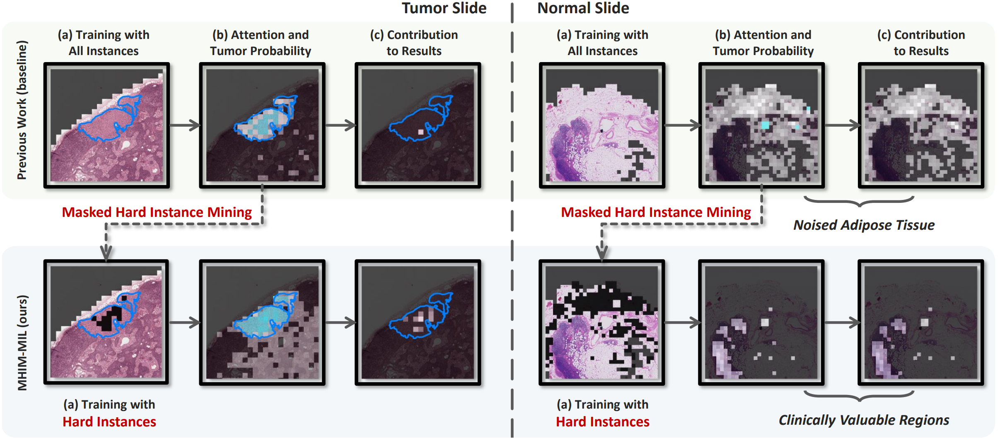

# MHIM-MIL
Official repo of **Multiple Instance Learning Framework with Masked Hard Instance Mining for Whole Slide Image Classification**, ICCV 2023. [[arXiv]](https://arxiv.org/abs/2307.15254) [[Slide]](doc/iccv_oral.pdf) [[Oral]](https://www.youtube.com/watch?v=ePZTtX0_tRQ)

Official repo of **Multiple Instance Learning Framework with Masked Hard Instance Mining for Gigapixel Histopathology Image Analysis**, arXiv 2025. [[arXiv]](https://arxiv.org/abs/2509.11526)



## News
- Released **MHIM-v2: a more concise and effective method, with stronger and broader generalizability, and enhanced interpretability.** [[arxiv]](https://arxiv.org/abs/2509.11526)
- I've updated the [preprocess parameters](dataset_csv/preprocess_tcga_nsclc.csv) of TCGA datasets. These parameters perform better on the NSCLC sub-project.
- I've found that the Baidu Cloud dataset link often fail, if you've found this you can leave an issue and I'll keep it updated. You can also check this [link](https://pan.baidu.com/s/1mSzLJ_RVCJFQGe2lZAvEUA?pwd=2024) to download the data you need.
- Another work, **Feature Re-Embedding: Towards Foundation Model-Level Performance in Computational Pathology**, about computational pathology has been accepted by **CVPR2024**. [[arXiv]](https://arxiv.org/abs/2402.17228) [[Code]](https://github.com/DearCaat/RRT-MIL)
- Updating DOCKERFILE ([Docker image](https://pan.baidu.com/s/1EN1JUbIjAl73NwHZF3YlPA?pwd=fek8) has been uploaded!)
- Uploaded [datasets](https://pan.baidu.com/s/13q1ymvMbEE54vW8eGpyPQA?pwd=2023), only including features
- Uploaded [paper slides](doc/iccv_oral.pdf) and [video](https://www.youtube.com/watch?v=ePZTtX0_tRQ)

## Prepare Patch Features
To preprocess WSIs, we used [CLAM](https://github.com/mahmoodlab/CLAM/tree/master#wsi-segmentation-and-patching).

Download the preprocessed patch features: [Baidu Cloud](https://pan.baidu.com/s/13q1ymvMbEE54vW8eGpyPQA?pwd=2023), [Backup Link](https://pan.baidu.com/s/1mSzLJ_RVCJFQGe2lZAvEUA?pwd=2024).

### Patching
`--preset` [bwh_biopsy.csv](https://github.com/mahmoodlab/CLAM/blob/master/presets/bwh_biopsy.csv) for C16 (*It's the preset parameters officially provided by CLAM*), `--preset` [preprocess_tcga_nsclc.csv](dataset_csv/preprocess_tcga_nsclc.csv) for TCGA-NSCLS (*It's the customized parameters*).
```shell
# for C16
python create_patches_fp.py --source DATA_DIRECTORY --save_dir RESULTS_DIRECTORY --patch_size 512 \
--step_size 512 --preset bwh_biopsy.csv --seg --patch
# for TCGA-NSCLC
python create_patches_fp.py --source DATA_DIRECTORY --save_dir RESULTS_DIRECTORY --patch_size 512 \
--step_size 512 --preset preprocess_tcga_nsclc.csv --seg --patch
```
### Feature Extraction
```shell
CUDA_VISIBLE_DEVICES=0,1 python extract_features_fp.py --data_h5_dir DIR_TO_COORDS --data_slide_dir \
DATA_DIRECTORY --csv_path CSV_FILE_NAME --feat_dir FEATURES_DIRECTORY --batch_size 512 --target_patch_size=224 --slide_ext .svs
```
## Training

Download the Docker Image: [Baidu Cloud](https://pan.baidu.com/s/1EN1JUbIjAl73NwHZF3YlPA?pwd=fek8).

### Prepare Your Own Initiation Weight
`model=pure baseline=[attn,selfattn,dsmil]`
```shell
# transmil baseline on C16 dataset
python3 main.py --project=$PROJECT_NAME --dataset_root=$DATASET_PATH --model_path=$OUTPUT_PATH --cv_fold=3 --title=transmil --model=pure --baseline=selfattn --seed=2021
# transmil baseline on TCGA-NSCLC dataset
python3 main.py --project=$PROJECT_NAME --datasets=tcga --dataset_root=$DATASET_PATH --model_path=$OUTPUT_PATH --cv_fold=4 --val_ratio=0.13 --title=transmil --model=pure --baseline=selfattn --seed=2021
# abmil baseline on C16 dataset
python3 main.py --project=$PROJECT_NAME --dataset_root=$DATASET_PATH --model_path=$OUTPUT_PATH --cv_fold=3 --title=abmil --model=pure --baseline=attn --seed=2021
# DSMIL baseline on C16 dataset
python3 main.py --project=$PROJECT_NAME --dataset_root=$DATASET_PATH --model_path=$OUTPUT_PATH --cv_fold=3 --title=dsmil --model=pure --baseline=dsmil --seed=2021
```
### Training MHIM-MIL
`--cv_fold=3 --val_ratio=0` for C16, `--cv_fold=4 --val_ratio=0.13` for TCGA-NSCLC
#### ABMIL
```shell
# C16
python3 main.py --project=$PROJECT_NAME --dataset_root=$DATASET_PATH --model_path=$OUTPUT_PATH --cv_fold=3 \
--teacher_init=./modules/init_ckp/c16_3fold_init_abmil_seed2021 --title=abmil_101_mr50h1-0r50_is --baseline=attn \
--num_workers=0 --cl_alpha=0.1 --mask_ratio_h=0.01 --mask_ratio_hr=0.5 --mrh_sche --init_stu_type=fc --mask_ratio=0.5 --mask_ratio_l=0. --seed=2021
# TCGA-NSCLC
python3 main.py --project=$PROJECT_NAME --dataset_root=$DATASET_PATH --model_path=$OUTPUT_PATH --cv_fold=4 \
--val_ratio=0.13 --teacher_init=./modules/init_ckp/tcga_4fold_init_abmil_seed2021 --title=abmil_105_mr70l20h2-0_mmcos_is \
--baseline=attn --num_workers=0 --cl_alpha=0.5 --mask_ratio_h=0.02 --mrh_sche --mm_sche --init_stu_type=fc --mask_ratio=0.7 --mask_ratio_l=0.2 --seed=2021
```
#### TransMIL
```shell
# C16
python3 main.py --project=$PROJECT_NAME --dataset_root=$DATASET_PATH --model_path=$OUTPUT_PATH --cv_fold=3 \
--teacher_init=./modules/init_ckp/c16_3fold_init_transmil_seed2021 --mask_ratio_h=0.03 --mask_ratio_hr=0.5 \
--mrh_sche --title=transmil_101_sml80h3-0r50_mmcos_is --mask_ratio=0. --mask_ratio_l=0.8 --cl_alpha=0.1 --mm_sche --init_stu_type=fc --attn_layer=0 --seed=2021
# TCGA-NSCLC
python3 main.py --project=$PROJECT_NAME --dataset_root=$DATASET_PATH --model_path=$OUTPUT_PATH --cv_fold=4 \
--val_ratio=0.13 --teacher_init=./modules/init_ckp/tcga_4fold_init_transmil_seed2021 --mask_ratio_h=0.02 \
--mrh_sche --title=transmil_105_smr60l20h2-0_is --mask_ratio=0.6 --mask_ratio_l=0.2 --cl_alpha=0.5 --init_stu_type=fc --attn_layer=0 --seed=2021
```
#### DSMIL (same hyper-param with ABMIL, maybe not optimal)
```shell
# C16
python3 main.py --project=$PROJECT_NAME --dataset_root=$DATASET_PATH --model_path=$OUTPUT_PATH --cv_fold=3 \
--teacher_init=./modules/init_ckp/c16_3fold_init_dsmil_seed2021 --title=dsmil_101_mr50h1-0r50_is --baseline=dsmil \
--num_workers=0 --cl_alpha=0.1 --mask_ratio_h=0.01 --mask_ratio_hr=0.5 --mrh_sche --init_stu_type=fc --mask_ratio=0.5 --mask_ratio_l=0. --seed=2021
# TCGA-NSCLC
python3 main.py --project=$PROJECT_NAME --dataset_root=$DATASET_PATH --model_path=$OUTPUT_PATH --cv_fold=4 \
--val_ratio=0.13 --teacher_init=./modules/init_ckp/tcga_4fold_init_dsmil_seed2021 --title=dsmil_105_mr70l20h2-0_mmcos_is \
--baseline=dsmil --num_workers=0 --cl_alpha=0.5 --mask_ratio_h=0.02 --mrh_sche --mm_sche --init_stu_type=fc --mask_ratio=0.7 --mask_ratio_l=0.2 --seed=2021
```
## Citing MHIM-MIL
```
@InProceedings{Tang_2023_ICCV,
    author    = {Tang, Wenhao and Huang, Sheng and Zhang, Xiaoxian and Zhou, Fengtao and Zhang, Yi and Liu, Bo},
    title     = {Multiple Instance Learning Framework with Masked Hard Instance Mining for Whole Slide Image Classification},
    booktitle = {Proceedings of the IEEE/CVF International Conference on Computer Vision (ICCV)},
    month     = {October},
    year      = {2023},
    pages     = {4078-4087}
}

@misc{tang2025multipleinstancelearningframework,
      title={Multiple Instance Learning Framework with Masked Hard Instance Mining for Gigapixel Histopathology Image Analysis}, 
      author={Wenhao Tang and Sheng Huang and Heng Fang and Fengtao Zhou and Bo Liu and Qingshan Liu},
      year={2025},
      eprint={2509.11526},
      archivePrefix={arXiv},
      primaryClass={cs.CV},
      url={https://arxiv.org/abs/2509.11526}, 
}
```
